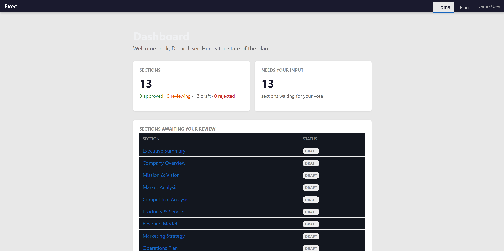
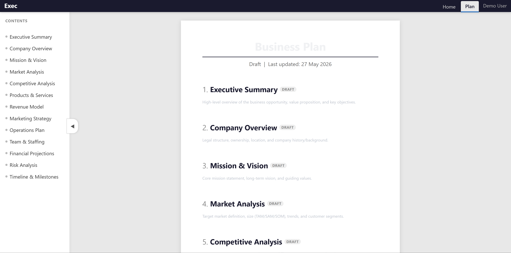

# Living Business Plan

**Reads like a document. Edits like a conversation. Decides like a board vote.**

A multi-stakeholder living document platform for small partnerships and teams. Write your plan in Markdown, discuss each section in threaded conversations, and make decisions through structured voting with mandatory reasoning.

No signup walls. No SaaS fees. Run it on your own machine.





## What it does

- **13-section business plan template** — Executive Summary through Timeline & Milestones (fully customisable)
- **Threaded discussion per section** — comment, debate, refine
- **Structured voting** — accept or reject with mandatory reasoning (no drive-by approvals)
- **Dynamic consensus** — auto-scales with partner count (solo → 1, pair → unanimous, 3+ → majority)
- **Partner management** — admin panel to add partners, assign roles (admin/partner/viewer), control access
- **Magic-link auth** — passwordless email login, or plug into your existing SSO
- **Customisable branding** — app name, document title, accent colour — all from the admin panel
- **Version history** — every edit is recorded, nothing is lost
- **Section locking** — optionally lock approved sections, reset votes on edit
- **Section cross-references** — link related sections (manual or AI-suggested)
- **Email notifications** — partners get notified when sections change or votes are cast
- **MCP server** — read and edit the plan from any AI chat client (Claude, etc.)

## Stack

- **Express 5** + custom Handlebars-like template engine (no build step)
- **HTMX** — modals, in-place updates, thread loading
- **Pico CSS** — clean, classless responsive base
- **PostgreSQL** — 7 tables in a `bizplan` schema
- **Python FastMCP** — optional MCP server for AI access (14 tools)

No webpack. No React. No build step. Edit a file, refresh the browser.

## Use cases

The default template is a business plan, but the platform works for any multi-stakeholder document that needs structured consensus:

| Use case | Sections become... |
|----------|--------------------|
| **Business plan** | Executive Summary, Market Analysis, Financial Projections... |
| **Partnership agreement** | Clauses — draft, debate, and ratify each one |
| **Co-op / HOA bylaws** | Articles of incorporation, membership rules, voting procedures |
| **Product RFC / design doc** | Proposal sections — propose, discuss, approve with reasoning |
| **Policy document** | Team policies, operating agreements, codes of conduct |
| **Grant / research proposal** | Co-authors refine sections, vote on direction |
| **Construction spec** | Scope items — sign off with mandatory reasoning |
| **Board governance** | Motions and resolutions with voting record |
| **Franchise operations manual** | SOPs — each procedure reviewed and signed off |
| **Investment thesis** | Due diligence sections — partners approve with rationale |
| **Event planning** | Venue, catering, schedule — each locked after consensus |

The thread + mandatory-reasoning-on-votes pattern is the key differentiator. Every approval requires a written explanation. No rubber stamps, no silent sign-offs. And because every vote and comment is preserved, you always know *why* a decision was made — not just *what* was decided.

Edit `db/seed.sql` to change the starting sections for your use case.

## Quick start

### Prerequisites

- Node.js 18+
- PostgreSQL 14+ (any OS)
- Python 3.10+ with `psycopg2` and `mcp` (only if you want the MCP server)

### Setup

```bash
# Clone
git clone https://github.com/YOUR_USERNAME/living-business-plan.git
cd living-business-plan

# Create the database
psql -U postgres -c "CREATE DATABASE exec"
psql -U postgres -d exec -f db/schema.sql
psql -U postgres -d exec -f db/seed.sql

# Configure
cp .env.example .env
# Edit .env — set DATABASE_URL and partner emails

# Install & run
npm install
node server.js
```

Open `http://localhost:8800`. In dev mode it auto-logs you in.

### MCP server (optional)

The MCP server gives AI assistants direct access to read, discuss, and vote on the plan.

```bash
pip install psycopg2-binary mcp
python exec_mcp.py
```

Supports `stdio` (for Claude Desktop/Code), `sse`, and `streamable-http` transports. Configure via environment variables — see the top of `exec_mcp.py`.

## How voting works

```
No votes           → draft
Any vote cast      → under_review
2 accepts          → approved
2 rejects          → rejected
2 accepts + reject → approved_with_objection
```

The threshold is configurable via `REQUIRED_VOTES` in `.env` (default: 2). Set to `1` for solo use or testing.

Every vote requires a written reason. No silent approvals, no rubber stamps. The reasoning is preserved in the section's thread alongside comments and edits.

## Authentication

Three modes (set `AUTH_MODE` in `.env`):

- **`dev`** — auto-login using `DEV_USER_EMAIL` / `DEV_USER_NAME` from `.env`. Good for solo use and testing.
- **`magic-link`** — email-based login. Partners enter their email, receive a one-time sign-in link. No passwords, no external dependencies — just SMTP.
- **`proxy`** — reads `Remote-Email` and `Remote-Name` headers from a reverse proxy (designed for [Authelia](https://www.authelia.com/), works with any SSO that injects headers).

All modes validate against the `partners` table. The first user is bootstrapped as admin from `DEV_USER_EMAIL`. Additional partners are added through the admin panel.

## Partner management

Partners are stored in the database (not in `.env`). Three roles:

- **Admin** — full access + admin panel (manage partners, branding, settings)
- **Partner** — read, comment, edit, vote
- **Viewer** — read and comment only (configurable)

The admin panel (`/admin`) lets you add partners, change roles, deactivate accounts, and configure branding and plan settings.

## Branding & settings

Configurable from the admin panel:

- **App name** — shown in the topbar and page titles
- **Document title** — "Business Plan", "Partnership Agreement", or whatever you're building
- **Accent colour** — one colour picker updates the entire UI
- **Lock approved sections** — prevent edits after consensus
- **Reset votes on edit** — clear existing votes when content changes
- **Viewer comments** — allow or restrict viewer participation

## Project structure

```
server.js           — Express app + template engine
lib/
  auth.js           — Three-mode auth (dev, magic-link, proxy)
  db.js             — PostgreSQL connection pool
  settings.js       — App settings loader (cached, from DB)
  status.js         — Vote → status engine (dynamic consensus)
  notify.js         — Email notifications via Nodemailer
routes/
  auth-routes.js    — Login, magic-link verify, logout
  admin.js          — Partner management + settings
  dashboard.js      — Landing page with stats + activity feed
  plan.js           — Document view + section CRUD
  thread.js         — Threaded comments per section
  vote.js           — Accept/reject with mandatory reason
views/
  layout.html       — Page shell (dynamic branding)
  login.html        — Magic-link login page
  admin.html        — Admin panel
  dashboard.html    — Dashboard template
  plan.html         — Full document view
  partials/         — Section card, thread modal, partner list
static/
  style.css         — Custom styles
  exec.js           — Client-side JS (modals, inline edit, HTMX helpers)
  htmx.min.js       — HTMX (local copy)
  pico.min.css      — Pico CSS (local copy)
db/
  schema.sql        — PostgreSQL schema (10 tables)
  migrate-001-partners.sql — Partners/settings migration (for existing installs)
  seed.sql          — 13 starter sections
exec_mcp.py         — MCP server (14 tools, direct PG access)
```

## Database

10 tables in the `bizplan` schema:

| Table | Purpose |
|-------|---------|
| `sections` | Business plan sections (hierarchical, Markdown body) |
| `thread_entries` | Threaded conversation per section |
| `votes` | Accept/reject with mandatory reasoning |
| `section_links` | Cross-references between sections |
| `notifications` | Email notification log |
| `section_history` | Immutable version history |
| `partners` | Registered users with roles (admin/partner/viewer) |
| `partner_invites` | Pending email invitations |
| `sessions` | Auth sessions for magic-link login |
| `settings` | App configuration (branding, consensus, behaviour) |

Reset everything:
```bash
psql -U postgres -c "DROP DATABASE exec"
psql -U postgres -c "CREATE DATABASE exec"
psql -U postgres -d exec -f db/schema.sql
psql -U postgres -d exec -f db/seed.sql
```

## MCP tools

The MCP server exposes 14 tools for AI-powered plan access:

**Read:** `list_sections`, `get_section`, `read_plan`, `get_thread`, `get_votes`, `dashboard`, `search_plan`, `get_history`, `get_links`

**Write:** `add_comment`, `cast_vote`, `edit_section`, `add_section`, `add_link`

This means you can discuss and refine your business plan directly from an AI chat — ask it to review a section, suggest improvements, or even cast a vote with reasoning.

## License

[AGPL-3.0](LICENSE) — free to use, modify, and self-host. If you run a modified version as a service, you must share your changes.
